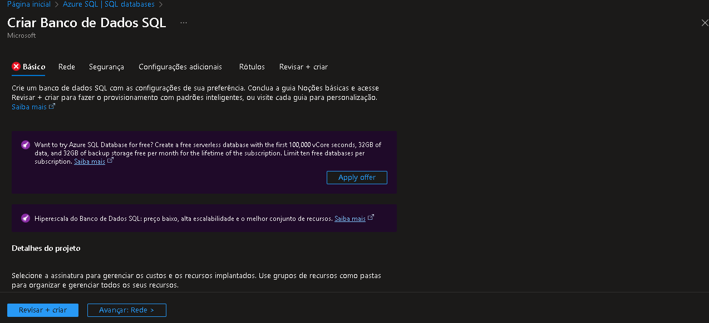
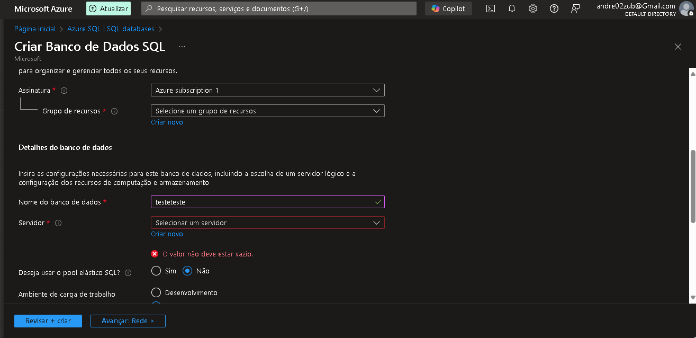
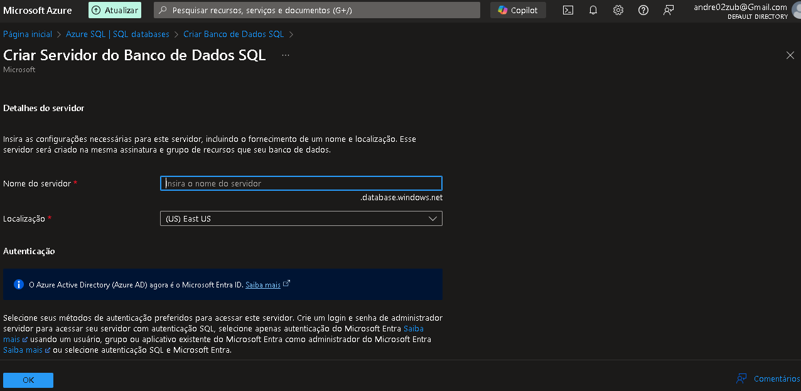
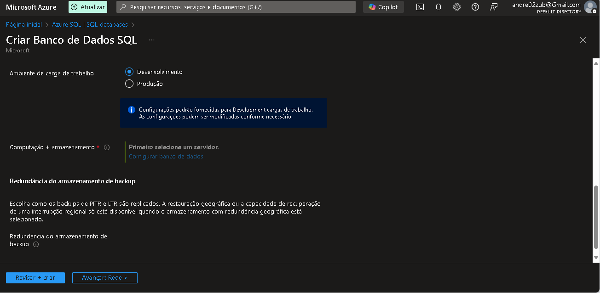
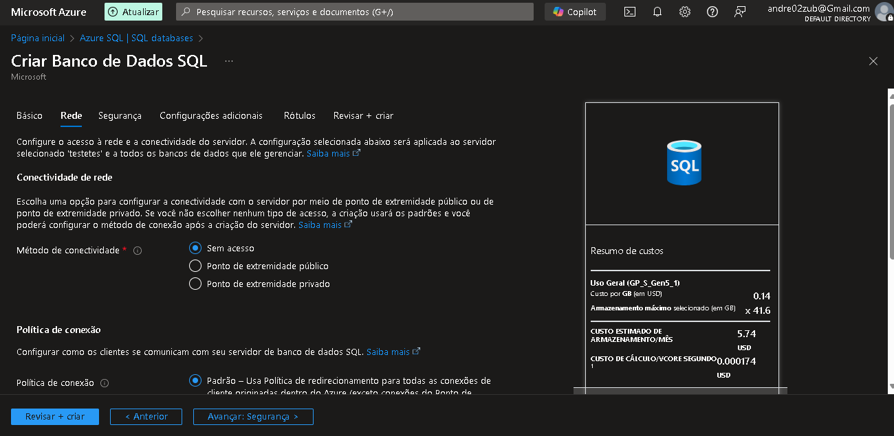
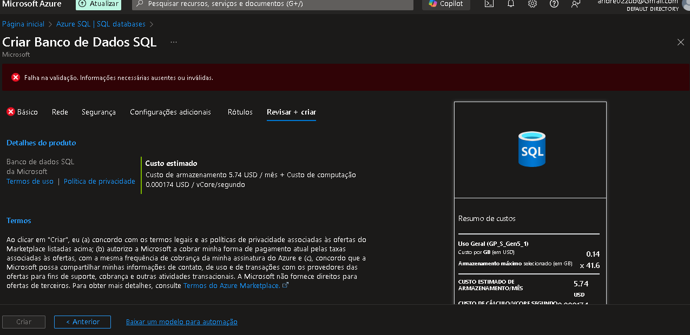
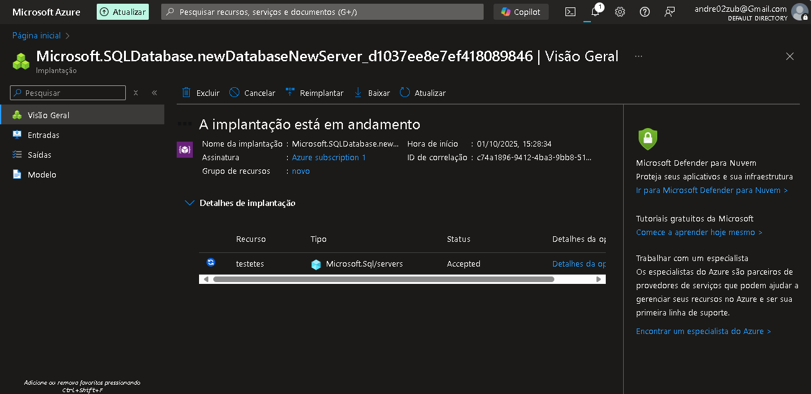

# Desafio: Criação de um Banco de Dados SQL na Plataforma Microsoft Azure

Este repositório documenta o processo de provisionamento e configuração de uma instância de Banco de Dados SQL na Microsoft Azure, como parte de um desafio prático para aplicar e documentar conhecimentos em serviços de nuvem.

O objetivo foi seguir o passo a passo de criação, desde a configuração inicial até a implantação final do recurso, registrando cada etapa com capturas de tela.

## 🚀 Etapas do Processo

O processo de criação do banco de dados foi dividido nas seguintes etapas:

### 1. Preparação do Ambiente

O processo iniciou na página do "Azure SQL", onde ainda não havia nenhum banco de dados criado, representando o ponto de partida do projeto.

### 2. Criação do Banco de Dados SQL

A criação foi iniciada clicando no botão "+ Criar". Na tela "Criar Banco de Dados SQL", foram preenchidas as informações básicas do projeto:

* **Assinatura:** `Azure subscription 1`
* **Grupo de Recursos:** Um novo grupo de recursos foi criado para organizar os serviços.
* **Nome do banco de dados:** `testeteste`
* **Servidor:** Como não havia um servidor existente, foi necessário criar um novo.

### 3. Configuração do Servidor

Na tela "Criar Servidor do Banco de Dados SQL", foram inseridas as credenciais de acesso, nome do servidor e a localização. Esta etapa é crucial para definir o ponto de acesso e a administração do banco de dados.

### 4. Ambiente e Configurações de Rede

* Foi selecionado o ambiente de carga de trabalho para **Desenvolvimento**, que aplica configurações padrão otimizadas para este cenário.
* Nas configurações de rede, foi mantido o método de conectividade padrão.

### 5. Revisão e Implantação

Após preencher todas as informações, a Azure realiza uma validação. Inicialmente, ocorreu uma falha por falta de informações, que foi corrigida para prosseguir.

Com as informações corretas, a implantação foi iniciada. A imagem abaixo mostra o status "A implantação está em andamento", confirmando que os recursos (servidor e banco de dados) estavam sendo criados com sucesso.

## ✔️ Conclusão

O desafio foi concluído com sucesso, permitindo praticar e documentar o processo de criação de um serviço de banco de dados PaaS (Plataforma como Serviço) na nuvem da Microsoft. Este exercício reforçou os conceitos de gerenciamento de recursos, servidores lógicos e configurações de banco de dados no Azure.

## 🛠️ Tecnologias Utilizadas

* **Microsoft Azure**
* **Azure SQL Database**# Desafio-DIO-Azure
